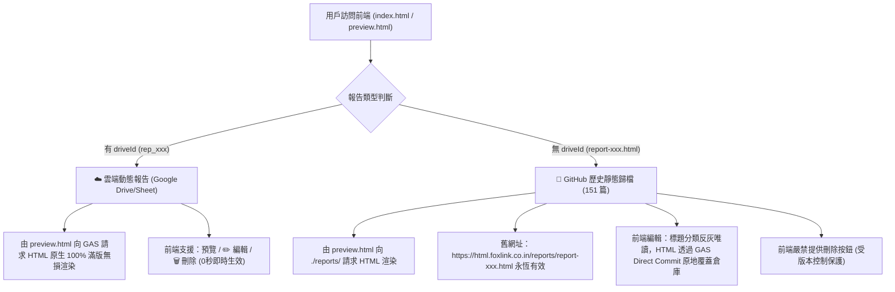

# 📋 專案工作交接文檔 (HANDOFF.md)

> 📌 **專案**: `htmal-report` (HTML 報告發布與展示中心)  
> 🕒 **交接時間**: 2026-09-29  
> 🌟 **核心架構**: Google Sheet / Drive 萬能雲端 SSOT + GitHub 歷史靜態雙軌架構  
> ⚠️ **單一真理源原則**: 本文檔為專案根目錄唯一合法交接合約，接班代理人請以此為準。

---

## 0. 🧠 智腦不二過記憶突觸 (Brain Synapse & Anti-Failure DNA)

### 📌 關鍵對話突觸 (Conversation Synapse)
- **當前交班會話 ID**: `1597af8b-9a21-41b0-a641-14cb590d361c`
- **歷史重大突破與修復里程碑**:
  1. **SSOT 真理鎖確立 (INCIDENT-20260929-01)**：
     - 徹底終結歷史文檔誤將業務流水帳 ID 記載為代碼倉庫的重大翻車。
     - 確立《HTML代碼倉庫》唯一的單一真理 ID：`1Fs921osBAcxuF45alc0IG20u5u_E6OIyCaL91qOKafY`。
     - 全專案代碼與文檔校準完畢，GAS 代碼已推送並發布新版本 `@5`。
  2. **iOS Safari / WebKit 渲染引擎徹底修復 (INCIDENT-20260929-02)**：
     - 淘汰不相容的 `document.write()`。
     - 發現 WebKit 會將 `Blob URL`（`blob:...`）視為隔離沙盒，阻斷向第三方域名（如 Foxlink 官網）請求子資源（導致 Logo 破圖）。
     - 底座 [`preview.html`](preview.html) 全面升級為 **`srcdoc` 優先雙軌渲染策略**，完整繼承父頁面 Origin，所有報告與外鏈 Logo 均 100% 秒開。
  3. **Google Drive 全量權限放行**：
     - 調用 GAS 批次指令 `make_all_public_editable`，將雲端現存全部 14 篇 HTML 報告設為「知道連結的人均可編輯」，未來新發布報告亦自動繼承。

### ⛔ 鋼鐵防線與不可違背之硬性鐵律 (Hard Invariants)
1. **🛑 絕對禁止破壞 151 篇歷史舊報告網址**：
   - 舊報告存放在 `reports/report-xxx.html`，外部已被大量系統（如 FollowLoop）歸檔。
   - **嚴禁刪除、移動或重新命名既有 `reports/` 底下的檔案**！前端嚴禁提供刪除按鈕，編輯時標題/分類反灰唯讀，HTML 透過 GAS Direct Commit 原地覆蓋。
2. **🛑 Google Sheet 台帳真理鎖定律 (SSOT Sheet Asset Lock)**：
   - 本專案綁定之 Google Sheet 唯一真理：**《HTML代碼倉庫》**（ID: `1Fs921osBAcxuF45alc0IG20u5u_E6OIyCaL91qOKafY`）。
   - **嚴禁自作聰明替換、改寫、重新關聯或在文檔傳播其他 Sheet ID**！
   - 任何代理人欲變更或校驗試算表時，**必須先比對試算表名稱（必須為《HTML代碼倉庫》）與頁籤結構（必須含 `工作表1` 與 `Config`）**，嚴禁盲連任何個人流水帳或業務表格！
3. **⚡ SWR 並行秒開架構保護 (Zero-Block Invariant)**：
   - `utils/reportsLoader.js` 中的 `loadReportsIndex()` **必須 100% 維持 `Promise.allSettled` 並行異步拉取**。本地 JSON 5ms 瞬間渲染，GAS 雲端並行同步。嚴禁改回串行阻塞等待！
4. **🎨 左右雙欄即時預覽編輯器規格保護**：
   - 編輯視圖必須維持原本 Admin Panel 標誌性的 **左側 HTML 代碼編輯（深色主題） ✕ 右側即時動態 iframe 滿版預覽 (`min-h-[520px]`)**，嚴禁退化為單一陽春彈窗！
5. **🔒 密碼認證與防護罩**：
   - 密碼優先讀取 Google Sheet《HTML代碼倉庫》`Config` 工作表（B1 格），保底密碼為 `10101010`，具備「記住我」持久化機制。
6. **⛔ 絕對禁止未授權 Git 推送鐵律 (No Unsolicited Push)**：
   - 除非使用者明確下達「推送倉庫」、「git push」、「推到 github」等指令，否則任何代理人嚴禁發起主動 push！

---

## 1. 🗺️ 專案物理架構與模組地圖 (Project Topology & Modules)

專案詳細拓撲已由 `project_structure_keeper` 治理，詳見 [`docs/TOPOLOGY.md`](docs/TOPOLOGY.md)：



### 核心模組職責邊界速查：
- [`reports/`](reports/)：歷史舊報告唯讀封存庫 (151 篇)，絕對受版本控制保護。
- [`utils/`](utils/)：`reportsLoader.js`（SWR 並行秒開核心載入器）。
- [`components/`](components/)：`HTMLEditor.js`、`PreviewPanel.js` 等左右雙欄預覽元件。
- [`gas/`](gas/)：GAS 後端萬能網關代碼 (`Code.gs`)。
- [`preview.html`](preview.html)：**新版雲端報告預覽入口**。
- [`docs/`](docs/)：DEV_DMC 研發知識庫 (`STATE.md`, `ACTIVE_LOG.md`, `TOPOLOGY.md`, `adr/`)。
- [`.agents/skills/`](.agents/skills/)：專案原生技能庫（`project_structure_keeper` 拓撲守護、`agent_code_map` AST 地圖、`html_report_publisher` 發布大師）。
- [`.agent_profiles/`](.agent_profiles/)：多模式規則庫（開發模式與生產模式切換）。

---

## 2. 🚨 【接班代理人首要任務 (Mission Handover)】
### 🎯 任務目標：優化 WhatsApp / LINE 分享報告連結時的 Open Graph (OG) 預覽卡片文字與圖片

### 📱 現狀問題與痛點 (Pain Point)
- **使用者回報**：
  當把報告預覽連結（例如 `https://html.foxlink.co.in/preview.html?id=rep_1790613215638&driveId=1nLBJB1q4IoYi-Fj-iVLmRfH8rx3xhUJM`）貼到 WhatsApp 或 LINE 聊天室時：
  - 聊天軟體抓出的預覽卡片標題為固定寫死的：「**報告加載中...**」
  - 域名顯示 `html.foxlink.co.in`，缺少報告專屬的封面圖片、摘要或動態標題（如下圖所示）。
- **技術根因 (Technical Root Cause)**：
  - WhatsApp / LINE 的爬蟲機器人（`WhatsApp/2.x` / `facebookexternalhit` / `LineBot`）**只抓取靜態 HTML 的 `<head>` Meta 標籤**（如 `<meta property="og:title">`、`<meta property="og:image">`、`<meta property="og:description">`），**不會執行 JavaScript**！
  - [`preview.html`](preview.html) 第 6 行的靜態標題是 `<title>報告加載中...</title>`，實際報告標題是由前端 JS 動態讀取 GAS API 後才改寫的，因此爬蟲完全抓不到真實標題與封面圖。

### 🔬 建議接班代理人與使用者討論的研究方向 (Options for Discussion)
接班代理人必須與使用者討論以下三種方案之可行性與取捨：

1. **方案 A：通用標準品牌 OG Card（純靜態、零運維成本、立即生效）**：
   - 在 [`preview.html`](preview.html) 的 `<head>` 靜態寫入專業的 Foxlink 品牌預覽卡片：
     - `og:title`: `Foxlink 企業情情報告與戰略簡報中心`
     - `og:description`: `點擊查閱完整高畫質 HTML 商業報告與 KYC 分析`
     - `og:image`: Foxlink 官方高畫質橫幅 Logo / 報告專屬封面圖直連網址（如 1200x630 尺寸）。
   - **優點**：不需任何後端動態轉譯，貼到任何通訊軟體都呈現乾淨、專業的企業級卡片，告別「報告加載中...」。
   - **缺點**：不同報告的卡片圖片與標題統一大氣，無法做到「每篇報告獨立標題」。

2. **方案 B：Cloudflare Worker / Edge SSR 動態 OG 注入（高精準、原生動態）**：
   - 目前本專案的網域名稱 `html.foxlink.co.in` 託管於 Cloudflare。
   - 可利用 Cloudflare Worker 在邊緣節點攔截針對 `/preview.html` 的爬蟲請求（偵測 `User-Agent` 是否為 WhatsApp/LineBot/Facebook）：
     - 爬蟲造訪時，Worker 先根據 URL 參數 `id` 查詢快取/API 取得該篇報告的真實標題與封面圖，動態置換 HTML `<head>` 的 OG 標籤後回傳給通訊軟體。
     - 真人造訪時，直接原樣放行到 GitHub Pages 靜態頁。
   - **優點**：100% 原生呈現該篇特定報告的真實標題、報告簡述與專屬封面圖！

3. **方案 C：GAS Web App 轉址或預覽包裝代理**：
   - 評估是否透過 GAS 後端直接作為爬蟲中繼。

---

## 3. 系統現況與關鍵雲端資產配置 (System Baseline & Assets)

- **Google Sheet 台帳名稱**：《HTML代碼倉庫》
- **Google Sheet 試算表 ID**：`1Fs921osBAcxuF45alc0IG20u5u_E6OIyCaL91qOKafY`
- **Google Sheet 線上網址**：[開啟 Google 試算表](https://docs.google.com/spreadsheets/d/1Fs921osBAcxuF45alc0IG20u5u_E6OIyCaL91qOKafY/edit)
- **Google Drive HTML 存儲資料夾**：`HTML_Reports_Store`
- **GAS 部署端點 (Web App Live URL - 版本 @5)**：
  `https://script.google.com/macros/s/AKfycbxcSYXocdTxhvYRq0A5eXsJqYvOI0xImay63Au9FSmolEwlbJ0My5Gr0aWUcvVpx8AiIA/exec`
- **AI Agent 一鍵發布工具**：[`.agents/skills/html_report_publisher/scripts/gas_publisher.py`](.agents/skills/html_report_publisher/scripts/gas_publisher.py)
  ```powershell
  py .agents\skills\html_report_publisher\scripts\gas_publisher.py --file "path/to/report.html" --title "報告標題" --categories "分類1,分類2" --desc "簡述"
  ```
- **多模式開發切換**：
  - 開發模式（當前模式）：`py .agent_profiles/switch_mode.py dev`（或雙擊 `切換為開發模式.bat`）
  - 生產模式（只查不改）：`py .agent_profiles/switch_mode.py prod`（或雙擊 `切換為生產模式.bat`）

---

## 4. 驗收啟動指令與導航門禁 (Pre-Flight Navigation & Verification Step)

進場代理人請於終端依序執行以下雙門禁指令，於記憶體中建立心智模型：

```powershell
# 1. 執行目錄拓撲與衛生審計 (確認 0 孤兒雜檔)
py .agents\skills\project_structure_keeper\scripts\keeper.py audit

# 2. 宏觀建立代碼拓撲記憶
py .agents\skills\agent_code_map\scripts\map.py
```
