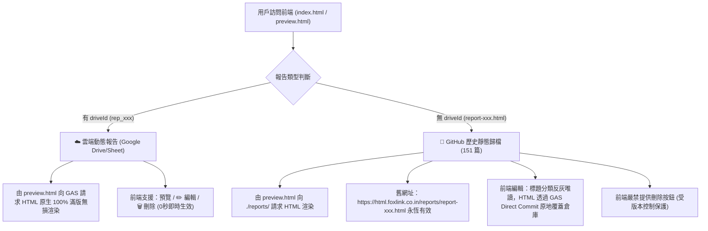

# 📋 專案工作交接文檔 (HANDOFF.md)

> 📌 **專案**: `htmal-report` (HTML 報告發布與展示中心)  
> 🕒 **交接時間**: 2026-09-29  
> 🌟 **核心架構**: Google Sheet / Drive 萬能雲端 SSOT + GitHub 歷史靜態雙軌架構  
> ⚠️ **單一真理源原則**: 本文檔為專案根目錄唯一合法交接合約，接班代理人請以此為準。

---

## 0. 🧠 智腦不二過記憶突觸 (Brain Synapse & Anti-Failure DNA)

### 📌 關鍵對話突觸 (Conversation Synapse)
- **當前交班會話 ID**: `74ac6e83-7669-4675-b7c8-1cc72bdb3a22`
- **歷史關聯背景**: 舊版 Node.js 後端已完整封存至分支 `backup-legacy-20260818`，線上已全面運行純前端 SWR + Google Apps Script (GAS) 雲端架構。
- **治理部署**: 本地 Git 已提交 `3f7248d`，成功播種 `project_structure_keeper`、`agent_code_map`、`dmc_knowledge_manager` 與 `agent_multi_rules_architect`。

### ⛔ 鋼鐵防線與不可違背之硬性鐵律 (Hard Invariants)
1. **🛑 絕對禁止破壞 151 篇歷史舊報告網址**：
   - 舊報告存放在 `reports/report-xxx.html`，外部已被大量系統（如 FollowLoop）歸檔。
   - **嚴禁刪除、移動或重新命名既有 `reports/` 底下的檔案**！前端嚴禁提供刪除按鈕，編輯時標題/分類反灰唯讀，HTML 透過 GAS Direct Commit 原地覆蓋。
2. **⚡ SWR 並行秒開架構保護 (Zero-Block Invariant)**：
   - `utils/reportsLoader.js` 中的 `loadReportsIndex()` **必須 100% 維持 `Promise.allSettled` 並行異步拉取**。本地 JSON 5ms 瞬間渲染，GAS 雲端並行同步。嚴禁改回串行阻塞等待！
3. **🎨 左右雙欄即時預覽編輯器規格保護**：
   - 編輯視圖必須維持原本 Admin Panel 標誌性的 **左側 HTML 代碼編輯（深色主題） ✕ 右側即時動態 iframe 滿版預覽 (`min-h-[520px]`)**，嚴禁退化為單一陽春彈窗！
4. **🔒 密碼認證與防護罩**：
   - 密碼優先讀取 Google Sheet《HTML代碼倉庫》`Config` 工作表（B1 格），保底密碼為 `10101010`，具備「記住我」持久化機制。
5. **⛔ 絕對禁止未授權 Git 推送鐵律 (No Unsolicited Push)**：
   - 除非使用者明確下達「推送倉庫」、「git push」、「推到 github」等指令，否則任何代理人嚴禁發起主動 push！

---

## 1. 🗺️ 專案最新物理架構與模組地圖 (Project Topology & Modules)

專案詳細拓撲已由 `project_structure_keeper` 治理，詳見 [`docs/TOPOLOGY.md`](docs/TOPOLOGY.md)：



### 核心模組職責邊界速查：
- [`reports/`](reports/)：歷史舊報告唯讀封存庫 (151 篇)，絕對受版本控制保護。
- [`utils/`](utils/)：`reportsLoader.js`（SWR 並行秒開核心載入器）。
- [`components/`](components/)：`HTMLEditor.js`、`PreviewPanel.js` 等左右雙欄預覽元件。
- [`gas/`](gas/)：GAS 後端萬能網關代碼 (`Code.gs`)。
- [`preview.html`](preview.html)：**新版雲端報告預覽入口（當前疑難排查焦點）**。
- [`docs/`](docs/)：DEV_DMC 研發知識庫 (`STATE.md`, `ACTIVE_LOG.md`, `TOPOLOGY.md`)。
- [`.agents/skills/`](.agents/skills/)：專案原生技能庫（`project_structure_keeper` 拓撲守護、`agent_code_map` AST 地圖、`html_report_publisher` 發布大師）。
- [`.agent_profiles/`](.agent_profiles/)：多模式規則庫（開發模式與生產模式切換）。

---

## 2. 🚨 【下一棒最高優先排查任務】新版報告在蘋果手機打不開問題

### 📱 故障現象與回報線索
- **使用者回報**：新版 HTML 報告連結在 **蘋果手機 (iOS / Safari / iPhone WebKit)** 上打不開或卡住。
- **出事連結範例**（來自使用者截圖）：
  ```text
  https://html.foxlink.co.in/preview.html?id=rep_1790613215638&driveId=1nLBJB1q4IoYi-Fj-iVLmRfH8rx3xhUJM
  ```
- **截圖展示**：該報告在桌面 Chrome 可以正常滿版展示（標題：*Target: Setindiabiz Private Limited*），但在 iPhone 上無法開啟。

### 🔬 預先驗屍與核心可疑代碼排查路徑 ([`preview.html`](preview.html))
接班代理人請重點針對 [`preview.html`](preview.html) 的第 80~112 行展開深入排查：

1. **死穴可疑點 A：`document.open()` / `document.write()` / `document.close()` 在 iOS Safari 的阻斷問題**：
   - `preview.html` 取得 HTML 後，透過 `document.write(htmlContent)` 覆寫整頁。
   - 在 iOS Safari（特別是異步 `await fetch` 結束後）調用 `document.write()`，Safari 常會直接拋出異常、靜默忽略、或停止渲染外部 script/style！
2. **死穴可疑點 B：GAS 重定向與 CORS 問題在 WebKit 上的表現**：
   - 請求 `https://script.google.com/macros/s/.../exec?action=get&driveId=...` 時，Google 會發起 `302 Moved Temporarily` 轉址到 `googleusercontent.com`。
   - Safari 在跨域轉址獲取純文字（TEXT/HTML）時對 `fetch` 的安全限制較為嚴苛，可能引發 `Fetch API cannot load ... due to access control checks`。
3. **死穴可疑點 C：報告代碼內部腳本衝突或 Content-Security-Policy (CSP)**：
   - 報告本身可能包含 Tailwind CDN、圖表腳本（如 Chart.js/ECharts），覆寫整頁後在 iOS 沙盒環境下觸發安全攔截。
4. **替代方案探討（Pre-mortem Alternative）**：
   - 若 `document.write()` 在 iOS 上無法相容，考慮改採**原生滿版 `iframe`（`width: 100vw; height: 100vh; border: none;`）搭配 `srcdoc` 或 `URL.createObjectURL(new Blob([html], {type: 'text/html'}))`**，此方式在 iOS WebKit 具備極高相容性！

---

## 3. 系統現況與關鍵雲端資產配置 (System Baseline & Assets)

- **Google Sheet 台帳名稱**：《HTML代碼倉庫》
- **Google Sheet 試算表 ID**：`1YgwlA-f5Iq487-0FVU2ChOckNVLb3h1ejbrUNkUr4WQ`
- **Google Sheet 線上網址**：[開啟 Google 試算表](https://docs.google.com/spreadsheets/d/1YgwlA-f5Iq487-0FVU2ChOckNVLb3h1ejbrUNkUr4WQ/edit)
- **Google Drive HTML 存儲資料夾**：`HTML_Reports_Store`
- **GAS 部署端點 (Web App Live URL)**：
  `https://script.google.com/macros/s/AKfycbxcSYXocdTxhvYRq0A5eXsJqYvOI0xImay63Au9FSmolEwlbJ0My5Gr0aWUcvVpx8AiIA/exec`
- **AI Agent 一鍵發布工具**：[`.agents/skills/html_report_publisher/scripts/gas_publisher.py`](.agents/skills/html_report_publisher/scripts/gas_publisher.py)
  ```powershell
  py .agents\skills\html_report_publisher\scripts\gas_publisher.py --file "path/to/report.html" --title "報告標題" --categories "分類1,分類2" --desc "簡述"
  ```
- **多模式開發切換**：
  - 開發模式（當前模式）：`py .agent_profiles/switch_mode.py dev`（或雙擊 `切換為開發模式.bat`）
  - 生產模式（只查不改）：`py .agent_profiles/switch_mode.py prod`（或雙擊 `切換為生產模式.bat`）

---

## 4. 驗收啟動指令與導航門禁 (Pre-Flight Navigation & Verification Step)

進場代理人請於終端依序執行以下雙門禁指令，於記憶體中建立心智模型：

```powershell
# 1. 目錄衛生與拓撲審計（掌握房間地圖）
py .agents\skills\project_structure_keeper\scripts\keeper.py audit

# 2. 宏觀代碼地圖抽取（掌握全域 Class 與 Def 拓撲）
py .agents\skills\agent_code_map\scripts\map.py

# 3. DMC 研發日誌健康度巡檢
py C:\Users\9892\.gemini\config\skills\dmc_knowledge_manager\scripts\dmc.py status
```
