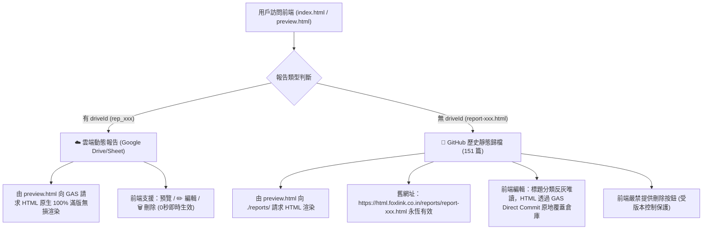

# 🚀 專案接手交接藍圖 (AI Agent Handover Roadmap)

> [!IMPORTANT]
> **🌟 寫在最前（接班代理人必讀）**：
> 本專案已完成從「本地 Node.js 舊架構」到「Google Sheet / Drive 萬能雲端 SSOT + GitHub Direct Commit 雙軌架構」的現代化升級。
> **舊有 151 篇歷史檔案已完整封存至分支 `backup-legacy-20260818`，且本地檔案與路徑 100% 完好無損，絕對沒有刪除任何舊資產！**

---

## 📌 1. 核心資產與雙軌邊界地圖 (Dual-Track SSOT Map)



---

## 🔐 2. 密碼認證與防護機制 (Auth SSOT)

- **預設密碼**：`10101010`
- **雲端密碼動態修改**：
  - 位於 Google Sheet **《HTML代碼倉庫》** 中的 **`Config`** 頁籤：
    - **A1**：`Admin_Password`
    - **B1**：自訂密碼字串（在 B1 修改後全系統即時生效）
  - 若 `Config` 頁籤不存在，系統自動降級以 `10101010` 驗證放行。
- **記住我 (Remember Me)**：
  - 勾選記住我時存入 `localStorage`，未勾選存入 `sessionStorage`。

---

## ⚡ 3. 效能與編輯器規格 (Performance & UI Invariants)

1. **SWR 並行秒開架構 (`utils/reportsLoader.js`)**：
   - 載入清單**必須 100% 採用 `Promise.allSettled` 並行異步拉取**（本地 JSON 5ms 瞬間先渲染，GAS 雲端並行同步，帶 6 秒逾時防禦）。
   - **嚴禁改回串行阻塞等待**！
2. **左右雙欄即時預覽編輯器 (`HTMLEditor.js` + `PreviewPanel.js`)**：
   - 編輯視圖必須維持原本 Admin Panel 標誌性的 **左側 HTML 代碼編輯（深色主題） ✕ 右側即時動態 iframe 滿版預覽 (`min-h-[520px]`)**。
   - **嚴禁退化為單一陽春彈窗**！

---

## 🛠️ 4. 關鍵檔案與後端網關配置

- **GAS 部署端點 (Web App URL)**：
  `https://script.google.com/macros/s/AKfycbxcSYXocdTxhvYRq0A5eXsJqYvOI0xImay63Au9FSmolEwlbJ0My5Gr0aWUcvVpx8AiIA/exec`
- **Google Sheet 台帳 ID**：`1YgwlA-f5Iq487-0FVU2ChOckNVLb3h1ejbrUNkUr4WQ`
- **Google Drive 存放資料夾**：`HTML_Reports_Store`
- **AI Agent 一鍵發布工具**：[`gas_publisher.py`](file:///e:/Projects/htmal-report/gas_publisher.py)
  ```powershell
  py gas_publisher.py --file "path/to/report.html" --title "報告標題" --categories "分類1,分類2" --desc "簡述"
  ```

---

## 🌿 5. Git 分支結構說明

- **`main`**：最新主分支（已部署上線，整合 GAS 萬能雲端、密碼鎖、雙軌載入器與完整左右雙欄編輯器）。
- **`backup-legacy-20260818`**：**舊架構永久安全備份分支**（包含舊 Node.js `admin/` 與歷史檔案，待線上運行數月穩定後再行評估清理）。

---

## 📋 6. 接班代理人驗收檢查清單 (Handover Verification)

當新代理人接手本專案時，請依序執行：
- [ ] 1. 檢視 `AGENTS.md` 專案鐵則。
- [ ] 2. 檢視 `.agents/skills/` 下的 `htmal_report_admin` 與 `html_report_publisher` 技能。
- [ ] 3. 確保未經使用者授權嚴禁發起 `git push`。
- [ ] 4. 確保任何修改不破壞 151 篇舊報告之既有網址。
