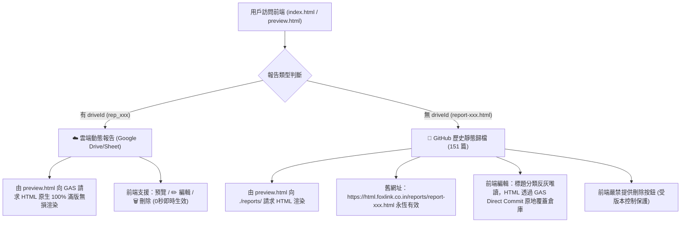

# 🚀 專案接手交接藍圖 (AI Agent Handover Roadmap)

> [!IMPORTANT]
> **🌟 寫在最前（接班代理人必讀）**：
> 本專案已完成從「本地 Node.js 舊架構」到「Google Sheet / Drive 萬能雲端 SSOT + GitHub Direct Commit 雙軌架構」的現代化升級。
> **舊有 151 篇歷史檔案已完整封存至分支 `backup-legacy-20260818`，且本地檔案與路徑 100% 完好無損，絕對沒有刪除任何舊資產！**

---

## 📌 1. 核心資產與雙軌邊界地圖 (Dual-Track SSOT Map)



---

## 🔐 2. 密碼認證與防護機制 (Auth SSOT)

- **預設密碼**：`10101010`
- **雲端密碼動態修改**：
  - 位於 Google Sheet **《HTML代碼倉庫》** 中的 **`Config`** 頁籤：
    - **A1**：`Admin_Password`
    - **B1**：自訂密碼字串（在 B1 修改後全系統即時生效）
  - 若 `Config` 頁籤不存在，系統自動降級以 `10101010` 驗證放行。
- **記住我 (Remember Me)**：
  - 勾選記住我時存入 `localStorage`，未勾選存入 `sessionStorage`。

---

## ⚡ 3. 效能與編輯器規格 (Performance & UI Invariants)

1. **SWR 並行秒開架構 (`utils/reportsLoader.js`)**：
   - 載入清單**必須 100% 採用 `Promise.allSettled` 並行異步拉取**（本地 JSON 5ms 瞬間先渲染，GAS 雲端並行同步，帶 6 秒逾時防禦）。
   - **嚴禁改回串行阻塞等待**！
2. **左右雙欄即時預覽編輯器 (`HTMLEditor.js` + `PreviewPanel.js`)**：
   - 編輯視圖必須維持原本 Admin Panel 標誌性的 **左側 HTML 代碼編輯（深色主題） ✕ 右側即時動態 iframe 滿版預覽 (`min-h-[520px]`)**。
   - **嚴禁退化為單一陽春彈窗**！

---

## 🛠️ 4. 關鍵雲端資產與後端網關配置 (Cloud SSOT Assets)

- **Google Sheet 台帳名稱**：《HTML代碼倉庫》
- **Google Sheet 線上編輯網址**：[https://docs.google.com/spreadsheets/d/1YgwlA-f5Iq487-0FVU2ChOckNVLb3h1ejbrUNkUr4WQ/edit](https://docs.google.com/spreadsheets/d/1YgwlA-f5Iq487-0FVU2ChOckNVLb3h1ejbrUNkUr4WQ/edit)
- **Google Sheet 試算表 ID**：`1YgwlA-f5Iq487-0FVU2ChOckNVLb3h1ejbrUNkUr4WQ`
- **Google Drive HTML 存儲資料夾**：`HTML_Reports_Store`
- **GAS 部署端點 (Web App Live URL)**：
  `https://script.google.com/macros/s/AKfycbxcSYXocdTxhvYRq0A5eXsJqYvOI0xImay63Au9FSmolEwlbJ0My5Gr0aWUcvVpx8AiIA/exec`
- **GitHub 直連憑證 (用於 GAS 原地 Commit 覆蓋舊報告)**：
  - 帳號：`gyhongyu`
  - 倉庫：`htmal-report`
  - Token：保存在 GAS 代碼中，由 GAS 後端發送 GitHub REST API（前端訪客完全接觸不到）。
- **AI Agent 一鍵發布工具**：[`gas_publisher.py`](file:///e:/Projects/htmal-report/gas_publisher.py)
  ```powershell
  py gas_publisher.py --file "path/to/report.html" --title "報告標題" --categories "分類1,分類2" --desc "簡述"
  ```

---

## 📜 5. GAS 萬能網關後端原始碼存檔 (Code.gs Reference)

若未來需要重新部署或檢查 GAS 代碼，最新部署之源碼如下：

```javascript
/**
 * HTML 報告專用 GAS 雲端萬能網關 v4 (含 GitHub REST API 直連原地覆蓋 Commit 引擎與密碼管理)
 */
const FOLDER_NAME = "HTML_Reports_Store";
// GITHUB_TOKEN 存放於 Google Sheet Config 表或讀取全域 github_manager 技能憑證
const GITHUB_TOKEN = "READ_FROM_GLOBAL_GITHUB_MANAGER_SKILL";
const GITHUB_OWNER = "gyhongyu";
const GITHUB_REPO = "htmal-report";

function doGet(e) {
  const params = e.parameter || {};
  const action = params.action || "list";
  const ss = SpreadsheetApp.getActiveSpreadsheet();
  
  // 1. 密碼驗證 (優先讀取 Config 頁籤 B1)
  if (action === "verify_password") {
    const inputPassword = params.password || "";
    const configSheet = ss.getSheetByName("Config");
    let actualPassword = "";
    if (configSheet) {
      const configData = configSheet.getDataRange().getValues();
      for (let i = 0; i < configData.length; i++) {
        if (configData[i][0] === "Admin_Password") {
          actualPassword = String(configData[i][1]).trim();
          break;
        }
      }
    }
    if (!actualPassword) actualPassword = "10101010"; // 預設安全保底
    return jsonResponse({ valid: (inputPassword === actualPassword) });
  }

  // 2. 取得報告清單
  if (action === "list") {
    const sheet = ss.getSheetByName("工作表1") || ss.getSheets()[0];
    const data = sheet.getDataRange().getValues();
    if (data.length <= 1) return jsonResponse({ reports: [] });
    const reports = [];
    for (let i = 1; i < data.length; i++) {
      const row = data[i];
      if (!row[0]) continue;
      reports.push({
        id: String(row[0]),
        title: row[1],
        categories: row[2] ? String(row[2]).split(",") : ["未分類"],
        createdAt: row[3],
        description: row[4] || "",
        driveId: row[5]
      });
    }
    return jsonResponse({ reports: reports.reverse() });
  }
  
  // 3. 取得單篇完整 HTML 代碼 (Drive 原生無損)
  if (action === "get") {
    const driveId = params.driveId;
    if (!driveId) return jsonResponse({ error: "Missing driveId" });
    try {
      const file = DriveApp.getFileById(driveId);
      const html = file.getBlob().getDataAsString();
      return ContentService.createTextOutput(html).setMimeType(ContentService.MimeType.TEXT);
    } catch (err) {
      return jsonResponse({ error: "Failed to read file: " + err.message });
    }
  }

  return jsonResponse({ status: "ok" });
}

function doPost(e) {
  try {
    const body = JSON.parse(e.postData.contents);
    const action = body.action || "save_report";
    const ss = SpreadsheetApp.getActiveSpreadsheet();
    const sheet = ss.getSheetByName("工作表1") || ss.getSheets()[0];

    // A. 原地覆蓋修改 GitHub 倉庫實體檔案 (舊報告修改專用)
    if (action === "update_github_file") {
      const fileName = body.fileName;
      const htmlContent = body.html;
      if (!fileName || !htmlContent) return jsonResponse({ success: false, error: "Missing fileName or html" });

      const getFileUrl = `https://api.github.com/repos/${GITHUB_OWNER}/${GITHUB_REPO}/contents/reports/${fileName}`;
      const getOptions = {
        method: "GET",
        headers: { "Authorization": "token " + GITHUB_TOKEN, "Accept": "application/vnd.github.v3+json", "User-Agent": "GAS-Report-Manager" },
        muteHttpExceptions: true
      };
      const getResp = UrlFetchApp.fetch(getFileUrl, getOptions);
      if (getResp.getResponseCode() !== 200) return jsonResponse({ success: false, error: "GitHub 查無此檔" });

      const fileSha = JSON.parse(getResp.getContentText()).sha;
      const base64Content = Utilities.base64Encode(Utilities.newBlob(htmlContent).getBytes());
      const putPayload = { message: `Update report via Web Admin: ${fileName}`, content: base64Content, sha: fileSha };
      const putOptions = {
        method: "PUT",
        headers: { "Authorization": "token " + GITHUB_TOKEN, "Accept": "application/vnd.github.v3+json", "User-Agent": "GAS-Report-Manager", "Content-Type": "application/json" },
        payload: JSON.stringify(putPayload),
        muteHttpExceptions: true
      };
      const putResp = UrlFetchApp.fetch(getFileUrl, putOptions);
      if (putResp.getResponseCode() === 200 || putResp.getResponseCode() === 201) {
        return jsonResponse({ success: true, message: "GitHub File Updated" });
      } else {
        return jsonResponse({ success: false, error: putResp.getContentText() });
      }
    }

    // B. 新增雲端報告 (Google Drive & Sheet)
    if (action === "save_report") {
      const title = body.title || "未命名報告";
      const categories = Array.isArray(body.categories) ? body.categories.join(",") : (body.categories || "未分類");
      const description = body.description || "";
      const html = body.html || "<h1>空白內容</h1>";
      const id = "rep_" + new Date().getTime();
      const createdAt = new Date().toISOString().split("T")[0];

      const folders = DriveApp.getFoldersByName(FOLDER_NAME);
      const folder = folders.hasNext() ? folders.next() : DriveApp.createFolder(FOLDER_NAME);
      const file = folder.createFile(id + ".html", html, "text/html");
      const driveId = file.getId();

      if (sheet.getLastRow() === 0) {
        sheet.appendRow(["ID", "Title", "Categories", "CreatedAt", "Description", "DriveFileID"]);
      }
      sheet.appendRow([id, title, categories, createdAt, description, driveId]);
      return jsonResponse({ success: true, id: id, driveId: driveId, title: title });
    }

    // C. 原地覆蓋更新雲端報告 (Google Drive)
    if (action === "update_report") {
      const id = body.id;
      const title = body.title;
      const categories = Array.isArray(body.categories) ? body.categories.join(",") : body.categories;
      const description = body.description || "";
      const html = body.html;

      const data = sheet.getDataRange().getValues();
      let rowIndex = -1, driveId = "";
      for (let i = 1; i < data.length; i++) {
        if (String(data[i][0]) === String(id)) {
          rowIndex = i + 1; driveId = data[i][5]; break;
        }
      }
      if (driveId && html) {
        try { DriveApp.getFileById(driveId).setContent(html); } catch (fErr) {}
      }
      if (rowIndex > 0) {
        if (title) sheet.getRange(rowIndex, 2).setValue(title);
        if (categories) sheet.getRange(rowIndex, 3).setValue(categories);
        sheet.getRange(rowIndex, 5).setValue(description);
      }
      return jsonResponse({ success: true, message: "Cloud Report Updated" });
    }

    // D. 刪除雲端報告
    if (action === "delete_report") {
      const id = body.id, driveId = body.driveId;
      if (driveId) { try { DriveApp.getFileById(driveId).setTrashed(true); } catch (e) {} }
      const data = sheet.getDataRange().getValues();
      for (let i = 1; i < data.length; i++) {
        if (String(data[i][0]) === String(id)) {
          sheet.deleteRow(i + 1); break;
        }
      }
      return jsonResponse({ success: true, message: "Deleted" });
    }

    return jsonResponse({ error: "Unknown action: " + action });
  } catch (err) {
    return jsonResponse({ success: false, error: err.message });
  }
}

function jsonResponse(obj) {
  return ContentService.createTextOutput(JSON.stringify(obj)).setMimeType(ContentService.MimeType.JSON);
}
```

---

## 🌿 5. Git 分支結構說明

- **`main`**：最新主分支（已部署上線，整合 GAS 萬能雲端、密碼鎖、雙軌載入器與完整左右雙欄編輯器）。
- **`backup-legacy-20260818`**：**舊架構永久安全備份分支**（包含舊 Node.js `admin/` 與歷史檔案，待線上運行數月穩定後再行評估清理）。

---

## 📋 6. 接班代理人驗收檢查清單 (Handover Verification)

當新代理人接手本專案時，請依序執行：
- [ ] 1. 檢視 `AGENTS.md` 專案鐵則。
- [ ] 2. 檢視 `.agents/skills/` 下的 `htmal_report_admin` 與 `html_report_publisher` 技能。
- [ ] 3. 確保未經使用者授權嚴禁發起 `git push`。
- [ ] 4. 確保任何修改不破壞 151 篇舊報告之既有網址。
